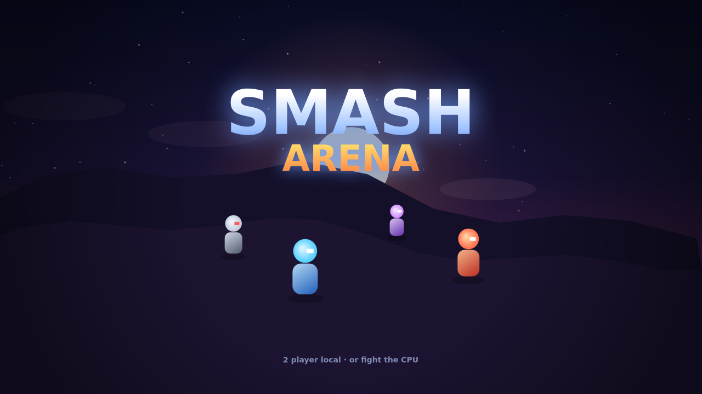
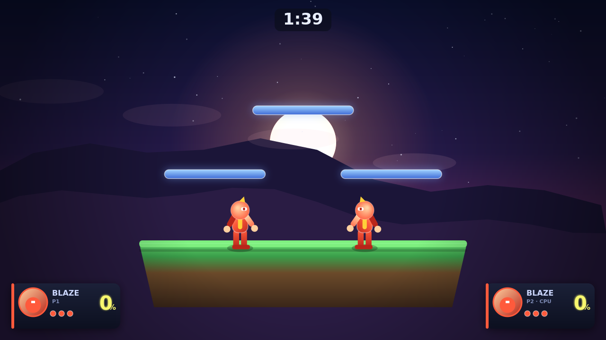

# SMASH ARENA

ブラウザだけで遊べる、スマブラ系のプラットフォームファイター（対戦格闘）です。
インストール不要 — `index.html` をブラウザで開くだけで起動します。

ダメージ％が溜まるほど吹っ飛びやすくなり、画面外（ブラストゾーン）まで
飛ばすとストックを1つ奪える…という、スマブラのコア部分を再現しています。




## 遊び方

`index.html` をダブルクリック（またはブラウザにドラッグ＆ドロップ）するだけ。
ビルド・サーバー・依存パッケージは一切不要です。

1. タイトルで **F / . / Space** を押してスタート
2. キャラクター選択（1Pと2P、2PはCPUにも切替可）
3. バトル開始！ 相手を画面外に吹っ飛ばしてKO

## 操作方法

| | 移動 | ジャンプ | 攻撃 | 必殺技 | シールド/回避 |
|---|---|---|---|---|---|
| **1P** | `W A S D` | `W` | `F` | `G` | `H` |
| **2P** | 方向キー | `↑` | `.` | `,` | `/` |

ゲームパッド（Xbox/同等）も自動で認識します。

### テクニック
- **2段ジャンプ** … 空中でもう一度ジャンプ
- **急降下** … 落下中に下を入力
- **すり抜け床** … 床の上で下を入力で下へ降りる
- **スマッシュ攻撃** … 横/上/下＋攻撃で強力な一撃（吹っ飛ばし大）
- **空中攻撃** … 空中で攻撃
- **必殺技** … 飛び道具（キャラごとに性能が違う）
- **シールド** … 押しっぱなしで防御。`シールド+左右`で回避ローリング、
  `シールド+下`でその場回避、空中で押すと空中回避（無敵）

## キャラクター

| キャラ | タイプ | 特徴 |
|---|---|---|
| **BLAZE** | バランス | 炎の格闘家。火球を撃つ標準性能 |
| **VOLT** | スピード | 電撃の忍者。素早く手数が多い・軽い |
| **TITAN** | パワー | 鋼鉄の巨人。重くて吹っ飛びにくく一撃が重い |
| **LUMEN** | トリッキー | 光の魔導士。よく跳ね、必殺技がホーミング |

## グラフィック

Switch風の質感を狙い、HTML5 Canvasで以下を実装しています:
- 多層パララックス背景（空のグラデーション・月光・山・雲・瞬く星）
- グラデーション＆リムライトでシェーディングしたキャラクター
- ヒットスパーク／衝撃波リング／パーティクル／煙／残像
- ヒットストップ（強攻撃で一瞬止まる）・画面シェイク・フラッシュ
- 戦況に合わせて寄り引きするダイナミックカメラ、画面外インジケータ
- ビネット、ダメージ％に応じて色が変わるHUD

> 注: 「Switch2レベル」を文字どおりのフォトリアル3Dで再現したものではなく、
> ブラウザで軽快に動く範囲で“それっぽく”見栄えを作り込んだ2D表現です。

## 開発・テスト

ゲーム本体はブラウザ標準APIのみで、依存ゼロです。
ロジックの自動テストは Node だけで実行できます:

```bash
node smoketest.js   # 1200フレームを実機ループで回し、実行時エラーが無いか確認
node mechtest.js    # ダメージ・吹っ飛び・KO・シールド等のコア仕様を検証
```

スクリーンショット生成（任意・`canvas`パッケージが必要）:

```bash
npm install canvas
node shot.js
```

## ファイル構成

```
index.html        エントリ（classicスクリプトを順に読み込み）
src/
  utils.js        数学・描画ヘルパ
  input.js        キーボード/ゲームパッド入力
  effects.js      パーティクル・衝撃波・シェイク・ヒットストップ
  stage.js        ステージ（足場・ブラストゾーン・背景）
  characters.js   キャラ定義（ステータス・技データ）
  fighter.js      ファイター本体（物理・状態・攻撃・描画）と飛び道具
  ai.js           CPU思考ルーチン
  render.js       HUD・画面演出
  main.js         シーン管理・カメラ・ゲームループ
```
